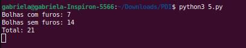

= Processamento Digital de Imagens (DCA0445)
Discente: Gabriela Cruz Targino
:toc: left
:toc-title: Sumário
:doctype: book

== 1. Prefácio

[.text-justify]
Este site contém a resolução dos exercícios que foram propostos na disciplina Processamento Digital de Imagens ofertada pelo Departamento de Engenharia de Computação e Automação da UFRN, ministrada pelo professor Agostinho Brito. As informações acerca da disciplina podem ser vista em: https://agostinhobritojr.github.io/tutorial/pdi/.

Os exercícios foram desenvolvidos em Python com a utilização da biblioteca OpenCV (https://opencv.org/).

== 2. Manipulando pixels em uma imagem
[.text-justify]
Para os dois programas desta seção, será utilizada a imagem abaixo como referência para as modificações:
[#aurora.jpg]
.Aurora
image::aurora.jpg[aurora, 500, 500]

=== 2.1. Negativo da imagem

[.text-justify]
Utilizando o programa pixels.cpp como referência, foi implementado um programa <<regions,regions.cpp>> O objetivo do programa é exibir uma determinada parte com o negativo da imagem fornecida, isto é, inverter as cores da região. Para isso, deverá ser solictado ao usuário que ele submeta coordenadas de dois pontos P1 e P2 localizados dentro dos limites do tamanho da imagem, sendo essa região exibida com o negativo da imagem.

[#regions.cpp]
.Código Fonte regions.cpp
[source,regions]
----
import cv2
import numpy as np

# Carregar a imagem
image = cv2.imread("aurora.jpg")

if image is None:
    print("Imagem não encontrada")
else:
    # Redimensionar a imagem
    image = cv2.resize(image, (300, 300))

# Solicitar ao usuário para selecionar os pontos
p1x = int(input(f"Escolha um ponto P1(x) entre 0 e {image.shape[1]}: "))
p2x = int(input(f"Escolha um ponto P2(x) entre 0 e {image.shape[1]}: "))
p1y = int(input(f"Escolha um ponto P1(y) entre 0 e {image.shape[0]}: "))
p2y = int(input(f"Escolha um ponto P2(y) entre 0 e {image.shape[0]}: "))

# Garantir que os pontos estejam dentro dos limites da imagem
p1x = max(0, min(p1x, image.shape[1]))
p2x = max(0, min(p2x, image.shape[1]))
p1y = max(0, min(p1y, image.shape[0]))
p2y = max(0, min(p2y, image.shape[0]))

# Inverter as cores da região selecionada
for i in range(p1y, p2y):
    for j in range(p1x, p2x):
        image[i, j] = 255 - image[i, j]

# Nome do arquivo de saída
output_filename = "imagem_negativa.jpg"

# Salvar a imagem resultante
cv2.imwrite(output_filename, image)

# Exibir a imagem resultante na janela
cv2.imshow("Negativo da Imagem", image)

# Aguardar até que uma tecla seja pressionada
cv2.waitKey(0)
cv2.destroyAllWindows()
----

[.text-justify]
Inicialmente, a imagem é carregada utilizando a função "cv2.imread" e redimensionada para um tamanho fixo. Em seguida, é solicitado ao usuário para que ele escolha os quatro valores que irão delimitar o quadrante da imagem negativa p1x, p2x, p1y e p2y, sendo feita uma verificação para garantir que os pontos estejam dentro dos limites da imagem. Então, é utilizado um loop aninhado for para percorrer cada pixel na região retangular definida pelos pontos P1 e P2, em que a intensidade da cor é invertida para cada pixel, o que cria uma imagem negativa dentro da região.

[#imagem_negativa.jpg]
.Região negativa
image::imagem_negativa.jpg[imagem_negativa, 300, 300]

=== 2.2. Trocar regiões

[.text-justify]
Utilizando o programa pixels.cpp como referência, foi implementado um programa <<trocaregioes,trocaregioes.cpp>> cujo objetivo é trocar os quadrantes em diagonal na imagem. 

[#trocaregioes.cpp]
.Código Fonte trocaregioes.cpp
[source,trocaregioes]
----
import cv2
import sys
import numpy as np

image = cv2.imread('aurora.jpg', cv2.IMREAD_GRAYSCALE)
if (image is None):
    print("Imagem não encontrada")

# Obter altura e largura da imagem    
altura, largura = image.shape

# Obter os quadrantes da imagem original
primeiroQuadrante = image[0:altura//2,0:largura//2]
segundoQuadrante = image[0:altura//2,largura//2:largura]
terceiroQuadrante = image[altura//2:altura,0:largura//2]
quartoQuadrante = image[altura//2:altura,largura//2:largura]

# Criar uma nova imagem com os quadrantes da imagem original trocados
imgTrocada = np.zeros((altura, largura), np.uint8)   
imgTrocada[0:altura//2,0:largura//2] = quartoQuadrante
imgTrocada[0:altura//2,largura//2:largura] = terceiroQuadrante
imgTrocada[altura//2:altura,0:largura//2] = segundoQuadrante
imgTrocada[altura//2:altura,largura//2:largura] = primeiroQuadrante

# Exibir imagem com quadrantes trocados
cv2.namedWindow('Imagem com Quadrantes Trocados', cv2.WINDOW_AUTOSIZE)
cv2.imshow('Imagem com Quadrantes Trocados', imgTrocada)

# Aguardar até que uma tecla seja pressionada
cv2.waitKey(0)
cv2.destroyAllWindows()
----

[.text-justify]
Para inverter os quadrantes da imagem, primeiro foi necessário obter a altura e largura da imagem a partir do método .shape, para dividi-la em quatro quadrantes em seguida. Então, foi criada uma nova imagem com tons de cinza contendo os quadrantes da imagem original reorganizados em posições opostas.

[#quadrantes_trocados.png]
.Quadrantes trocados

== 3. Serialização de dados em ponto flutuante via FileStorage

== 4. Decomposição de imagens em planos de bits

=== 4.1 Desafio da imagem codificada
[.text-justify]
Utilizando o programa esteg-encode.cpp como referência, foi implementado um programa <<decodificacao,decodificacao.cpp>>. O objetivo do programa é recuperar a imagem codificada de uma imagem resultante de esteganografia. Para isso, será utilizada a imagem codificada abaixo.

[#esteganografia.png]
.Imagem codificada
image::esteganografia.png[esteganografia]

[#decodificacao.cpp]
.Código Fonte decodificacao.cpp
[source,decodificacao]
----
import cv2

# Carregar a imagem
imagemFinal = cv2.imread("esteganografia.png")

# Verificar se a imagem foi carregada com sucesso
if imagemFinal is None:
    print("Imagem não encontrada")
else:
    # Clonar a imagem para trabalhar com uma cópia
    imagemEscondida = imagemFinal.copy()

    # Exibir a imagem original
    cv2.imshow("", imagemFinal)
    cv2.waitKey()
    cv2.destroyWindow("")

    nbits = 3  # Número de bits para deslocamento

    # Aplicar o deslocamento nos canais de cores
    for i in range(imagemEscondida.shape[0]):
        for j in range(imagemEscondida.shape[1]):
            valEscondida = imagemEscondida[i, j]
            valEscondida[0] = valEscondida[0] << (8 - nbits)
            valEscondida[1] = valEscondida[1] << (8 - nbits)
            valEscondida[2] = valEscondida[2] << (8 - nbits)
            imagemEscondida[i, j] = valEscondida

    # Exibir a imagem com os canais deslocados
    cv2.imshow("", imagemEscondida)
    # Nome do arquivo de saída
    output_filename = "esteganografia_escondida.jpg"

    # Salvar a imagem resultante
    cv2.imwrite(output_filename, imagemEscondida)
    cv2.waitKey()
    cv2.destroyAllWindows()
----

[.text-justify]
O código acima realiza uma operação de deslocamento de bits nos canais de cores de uma imagem como técnica para desvendar a imagem, sendo o número de bits para deslocamento configurado como 3 bits. 

[.text-justify]
Para aplicar o deslocamento nos canais de cores, são utilizados loops aninhados para iterar por todos os pixels da imagem. Para cada pixel, os bits menos significativos da imagem codificada são deslocados à esquerda em (8 - nbits).

[.text-justify]
Como resultado, foi obtida a imagem abaixo:

[#esteganografia_escondida.jpg]
.Imagem decodificada

== 5. Preenchendo regiões
=== 5.1 Algoritmo labeling.cpp
[.text-justify]
Com base no programa labeling.cpp, foi desenvolvido um programa <<preencheregioes,preencheregioes.cpp>> com o objetivo de:

1. Rotular elementos caso existam mais de 255 na imagem;
2. Fazer a contagem de regiões com ou sem buracos internos na imagem. 

[.text-justify]
Para isso, foi utilizado como base a imagem abaixo:

[#bolhas.png]
.Bolhas
image::bolhas.png[bolhas]

[#preencheregioes.cpp]
.Código Fonte preencheregioes.cpp
[source,preencheregioes]
----
import cv2
import numpy as np

# Carregar a imagem em escala de cinza
original = cv2.imread("bolhas.png", cv2.IMREAD_GRAYSCALE)

# Verificar se a imagem foi carregada com sucesso
if original is None:
    print("Imagem não encontrada")
else:
    image = original.copy()
    p = (0, 0)
    n_com_furos = 0
    n_sem_furos = 0

    # Retirar as bolhas que estejam nas bordas
    for i in range(image.shape[0]):
        # Borda esquerda
        if image[i, 0] == 255:
            p = (0, i)
            cv2.floodFill(image, None, p, 0)
        # Borda direita
        if image[i, -1] == 255:
            p = (image.shape[1] - 1, i)
            cv2.floodFill(image, None, p, 0)

    for i in range(image.shape[1]):
        # Borda superior
        if image[0, i] == 255:
            p = (i, 0)
            cv2.floodFill(image, None, p, 0)
        # Borda inferior
        if image[-1, i] == 255:
            p = (i, image.shape[0] - 1)
            cv2.floodFill(image, None, p, 0)

    # Preencher fundo com cor diferente
    p = (0, 0)
    cv2.floodFill(image, None, p, 1)

    # Bolhas com 1 furo ou mais
    for i in range(image.shape[0]):
        for j in range(image.shape[1]):
            if image[i, j] == 0 and image[i - 1, j - 1] == 255:
                n_com_furos += 1

                p = (j - 1, i - 1)
                cv2.floodFill(image, None, p, 80)

                p = (j, i)
                cv2.floodFill(image, None, p, 128)

            # Furos dentro de bolhas já contadas
            if image[i, j] == 255 and image[i - 1, j - 1] == 128:
                p = (j, i)
                cv2.floodFill(image, None, p, 180)

    # Bolhas sem furos
    for i in range(image.shape[0]):
        for j in range(image.shape[1]):
            if image[i, j] == 255:
                n_sem_furos += 1
                p = (j, i)
                cv2.floodFill(image, None, p, 254)
    
    total = n_com_furos + n_sem_furos

    print("Bolhas com furos:", n_com_furos)
    print("Bolhas sem furos:", n_sem_furos)
    print("Total:", total) 

    cv2.imshow("image", image)
    cv2.waitKey(0)
    cv2.destroyAllWindows()
----

[.text-justify]
O programa desenvolvido utiliza o método floodFill para remover as bolhas nas bordas, preenchendo-as com o valor 0 (preto). Em seguida, a cor de fundo foi alterada para um tom de cinza e foi utilizado o floodFill novamente, de modo que, ao detectar um objeto com cor preta por dentro, os pixels da bolha com furo são marcados com valores diferentes para auxiliar na identificação das bolhas com furos. O resultado final pode ser visualizado abaixo:

[#bolhas_final.png]
.Resultado final

[#contagem_bolhas.png]
.Contagem de bolhas

== 6. Manipulação de histograma
=== 6.1 Algoritmo equalize.cpp
[.text-justify]
Neste exercício, foi desenvolvido o código <<equalize,equalize.cpp>> tendo como base o programa histogram.cpp. O objetivo da atividade foi realizar a equalização do histograma de uma imagem capturada pela câmera do computador.

[#equalize.cpp]
.Código Fonte equalize.cpp
[source,equalize]
----
import cv2
import numpy as np

cap = cv2.VideoCapture(0)

if not cap.isOpened():
    print("Imagem não encontrada")
else:
    cap.set(cv2.CAP_PROP_FRAME_WIDTH, 640)
    cap.set(cv2.CAP_PROP_FRAME_HEIGHT, 480)
    width = int(cap.get(cv2.CAP_PROP_FRAME_WIDTH))
    height = int(cap.get(cv2.CAP_PROP_FRAME_HEIGHT))

    print("largura =", width)
    print("altura =", height)

    nbins = 64
    histw = nbins
    histh = nbins // 2

    while True:
        ret, frame = cap.read()

        if not ret:
            break

        # Dividir os canais de cores
        b, g, r = cv2.split(frame)

        # Equalizar o histograma dos canais de cores
        b_eq = cv2.equalizeHist(b)
        g_eq = cv2.equalizeHist(g)
        r_eq = cv2.equalizeHist(r)

        # Mesclar os canais de volta para formar a imagem colorida equalizada
        equalized_frame = cv2.merge([b_eq, g_eq, r_eq])

        cv2.imshow("Resultado", equalized_frame)

        if cv2.waitKey(30) == 27:
            break

    cap.release()
    cv2.destroyAllWindows()
----

[.text-justify]
Para inicializar a câmera do computador, foi utilizado o método "VideoCapture.(0)" do OpenCV, no qual "0" indica o uso da câmera padrão. Cada quadro de vídeo da câmera é lido utilizando o método "read()" e armazenado na variável "frame". Então, o quadro é dividido em seus canais de cores BGR e cada canal é equalizado individualmente utilizando a função "equalizeHist". O resultado do programa pode ser visto abaixo:

[#equalizacao.png]
.Imagem com histograma equalizado
image::equalizacao.png[equalizacao]

=== 6.2 Algoritmo motiondetector.cpp

== 7. Filtragem no domínio espacial I
=== 7.1 Filtro laplaciano do gaussiano
[.text-justify]
Tendo o programa filtroespacial.cpp como referência, foi implementado o programa <<laplauss,laplauss.cpp>> com o objetivo de calcular o laplaciano do gaussiano de imagens capturadas na câmera do computador.

[#laplauss.cpp]
.Código Fonte laplauss.cpp
[source,laplauss]
----
from typing import Match
import numpy as np
import sys
import cv2

# Criar funções para auxiliar no código
class Filtros:
    media = np.array([[0.1111, 0.1111, 0.1111],
                      [0.1111, 0.1111, 0.1111],
                      [0.1111, 0.1111, 0.1111]],dtype=np.float32)
    gauss = np.array([[0.0625,0.125,0.0625],
                      [0.125, 0.25,0.125],
                      [0.0625, 0.125,  0.0625]],dtype=np.float32)
    horizontal = np.array([[-1,0,1],
                           [-2,0,2],
                           [-1,0,1]],dtype=np.float32)
    vertical = np.array([[-1,-2,-1],
                         [0,0,0],
                         [1,2,1]],dtype=np.float32)
    laplace = np.array([[0,-1,0],
                        [-1,4,-1],
                        [0,-1,0]],dtype=np.float32)
    boost = np.array([[0, -1, 0],
                      [-1, 5.2, -1],
                      [0, -1, 0]],dtype=np.float32)

cap = cv2.VideoCapture(0)
if not cap.isOpened():
    sys.exit("Não foi possível abrir a câmera.")

cap.set(cv2.CAP_PROP_FRAME_WIDTH, 640);
cap.set(cv2.CAP_PROP_FRAME_HEIGHT, 480);

absolute = True
doLaplacian = False
mask = Filtros.media

print('Filtragem Media escolhida como padrão')
print("\Press the key correspondent to the filter: \n"
        "a - abs\n"
        "m - mean\n"
        "g - gauss\n"
        "v - vertical\n"
        "h - horizontal\n"
        "l - laplacian\n"
        "b - boost\n"
        "p - gaussian laplacian\n"
        "esc - quit\n")

while True:
    # Capturar frame por frame
    ret, frame = cap.read()
    # Verificar se o frame foi aberto
    if not ret:
        print("Imagem não encontrada.")
        break

    # Trasformar a imagem recebida em escala de cinza
    gray = cv2.cvtColor(frame, cv2.COLOR_BGR2GRAY)
    imageFloat32 = np.array(gray, dtype=np.float32)
    
    # Realizar a filtragem escolhida
    imgFiltrada = cv2.filter2D(imageFloat32,-1,mask, anchor=(1,1))
    
    if(doLaplacian):
        mask = Filtros.laplace
        imgLaplGaussFiltrada = cv2.filter2D(imgFiltrada,-1,mask, anchor=(1,1))
 
        if absolute:
            imgLaplGaussFiltrada = abs(imgLaplGaussFiltrada)
            
        result = np.array(imgLaplGaussFiltrada, dtype=np.uint8)
        
        res = np.hstack((gray, result))
        cv2.imshow('Filtrando', res)
        
        mask = Filtros.gauss
    else:
        if absolute:
            imgFiltrada = abs(imgFiltrada)
    
        result = np.array(imgFiltrada, dtype=np.uint8)
        
        res = np.hstack((gray, result))
        cv2.imshow('Filtrando', res)
    
    key = cv2.waitKey(10)
    if(key == 27):
        break
    elif(key == ord('a')):
        print('abs modificado')
        absolute = not absolutefloat LoG[] = {1,2,1,
               2,-16,2,
               1,2,1};
    elif(key == ord('m')):
        doLaplacian = False
        print('media escolhida')
        mask = Filtros.media
        print(mask)
    elif(key == ord('g')):
        doLaplacian = False
        print('Gauss escolhida')
        mask = Filtros.gauss
        print(mask)
    elif(key == ord('l')):
        doLaplacian = False
        print('Laplacian escolhida')
        mask = Filtros.laplace
        print(mask)
    elif(key == ord('h')):
        doLaplacian = False
        print('Horizontal escolhida')
        mask = Filtros.horizontal
        print(mask)
    elif(key == ord('v')):
        doLaplacian = False
        print('Vertical escolhida')
        mask = Filtros.vertical
    elif(key == ord('b')):
        doLaplacian = False
        print('Boost escolhida')
        mask = Filtros.boost
        print(mask)
    elif(key == ord('p')):
        print('Laplacian Gauss escolhida')
        mask = Filtros.gauss
        print(mask, '/n', Filtros.laplace)
        doLaplacian = True
        
cap.release()
cv2.destroyAllWindows()
----

[.text-justify]
No início do programa, foram definidas as matrizes de diferentes filtros que o usuário pode selecionar para aplicar na imagem. Para aplicar o filtro laplaciano do gaussiano, primeiro é utilizado o filtro gaussiano e, em seguida, o laplaciano. A comparação entre o resultado do laplaciano do gaussiano e o resultado apenas do laplaciano pode ser vista abaixo:

[#laplaciano.png]
.Filtro laplaciano

[#laplacianogaussiano.png]
.Filtro laplaciano do gaussiano

[.text-justify]
É possível observar que, com o filtro laplaciano do gaussiano, a imagem primeiro é suavizada e em seguida as bordas da imagem são realçadas. 

== 8. Filtragem no domínio espacial II
=== 8.1 Algoritmo tiltshift.cpp
[.text-justify]
Com base no programa addweighted.cpp, foi implementado o programa <<tiltshift,tiltshift.cpp>> de modo a implementar três ajustes na tela de interface:

1. Um ajuste para regular a altura da região central que entrará em foco;
2. Um ajuste para regular a força de decaimento da região borrada;
3. Um ajuste para regular a posição vertical do centro da região que entrará em foco.

[#tiltshift.cpp]
.Código Fonte tiltshift.cpp
[source,tiltshift]
----
import cv2
import numpy as np

# Parâmetros iniciais
l1 = -100
l2 = 50
d = 6
centro = 100
matriz_media_tam = 7
altura = 0
largura = 0
slider_altura = 0
slider_altura_max = 100
slider_decaimento = 0
slider_decaimento_max = 100
slider_deslocamento = 0
slider_deslocamento_max = 100
imagem = None
imagem_borrada = None
ponderada = None
ponderada_negativa = None

def addEffect():
    global l1, l2, d, centro, altura, largura, imagem, imagem_borrada, ponderada, ponderada_negativa

    altura, largura, _ = imagem.shape
    centro = slider_deslocamento * altura // 100

    # Calcular a ponderação para o efeito tilt-shift
    for i in range(altura):
        fx = 0.0
        if d != 0:
            fx = -0.5 * (np.tanh((i - centro + l1) / d) - np.tanh((i - centro + l2) / d))
        else:
            fx = -0.5 * (np.tanh((i - centro + l1) / 0.01) - np.tanh((i - centro + l2) / 0.01))

        for j in range(largura):
            ponderada[i, j] = [fx, fx, fx]
            ponderada_negativa[i, j] = [1.0 - fx, 1.0 - fx, 1.0 - fx]

    # Aplicar o efeito ponderado na imagem original e na imagem borrada
    res1 = imagem * ponderada
    res2 = imagem_borrada * ponderada_negativa

    # Combinar as duas imagens resultantes
    resultado = cv2.addWeighted(res1, 1, res2, 1, 0)
    resultado = resultado.astype(np.uint8)

    # Exibir o resultado
    cv2.imshow("tiltshift", resultado)

# Funções para atualizar os parâmetros via trackbars
def on_trackbar_deslocamento(val):
    global slider_deslocamento, centro
    slider_deslocamento = val
    centro = slider_deslocamento * altura // 100
    addEffect()

def on_trackbar_altura(val):
    global slider_altura, l1, l2
    slider_altura = val
    alt = altura * slider_altura // 100
    l1 = -alt // 2
    l2 = alt // 2
    addEffect()

def on_trackbar_decaimento(val):
    global slider_decaimento, d
    slider_decaimento = val
    d = slider_decaimento
    addEffect()

if __name__ == "__main__":
    # Criar uma matriz de filtro de média para borrar a imagem
    media = np.full((matriz_media_tam, matriz_media_tam), 1.0 / (matriz_media_tam * matriz_media_tam), dtype=np.float32)
    masc_media = np.float32(media)

    # Carregar a imagem e aplica um filtro de média
    imagem = cv2.imread("aurora.jpg").astype(np.float32)
    imagem_borrada = cv2.filter2D(imagem, -1, masc_media)

    largura = imagem.shape[1]
    altura = imagem.shape[0]

    ponderada = np.zeros((altura, largura, 3), dtype=np.float32)
    ponderada_negativa = np.zeros((altura, largura, 3), dtype=np.float32)

    # Criar uma janela para exibir o resultado
    cv2.namedWindow("tiltshift", cv2.WINDOW_NORMAL)

    # Criar trackbars para controlar os parâmetros
    cv2.createTrackbar("Altura x {}".format(slider_altura_max), "tiltshift", slider_altura, slider_altura_max, on_trackbar_altura)
    on_trackbar_altura(slider_altura)

    cv2.createTrackbar("Decaimento x {}".format(slider_decaimento_max), "tiltshift", slider_decaimento, slider_decaimento_max, on_trackbar_decaimento)
    on_trackbar_decaimento(slider_decaimento)

    cv2.createTrackbar("Deslocamento x {}".format(slider_deslocamento_max), "tiltshift", slider_deslocamento, slider_deslocamento_max, on_trackbar_deslocamento)
    on_trackbar_deslocamento(slider_deslocamento)

    addEffect()

    cv2.waitKey(0)
    cv2.destroyAllWindows()
----

[.text-justify]
O algoritmo acima para aplica o efeito de tiltshift a uma imagem, isto é, uma técnica de processamento de imagens que cria uma região borrada na figura. O resultado da implementação pode ser visto abaixo:

[#aurora_tiltshift.png]
.Imagem com tiltshift

=== 8.2 tiltshiftvideo.cpp
